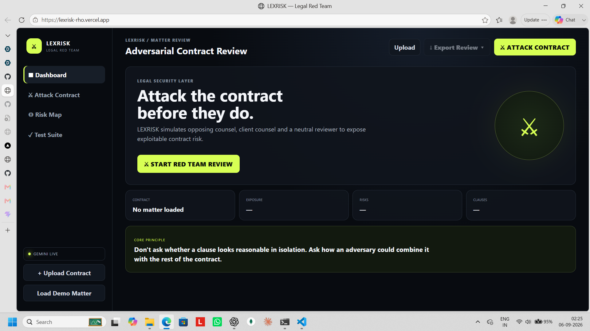
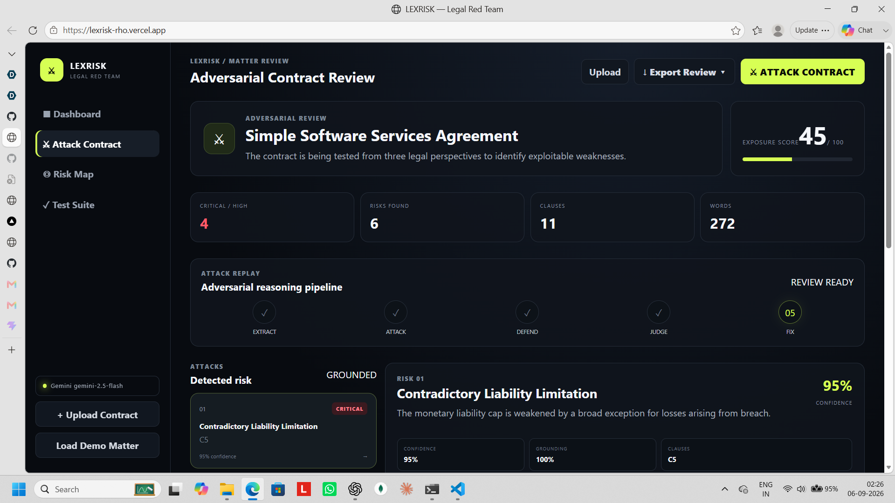
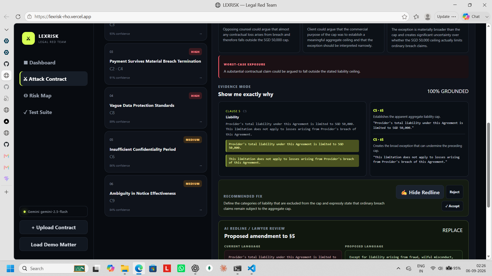
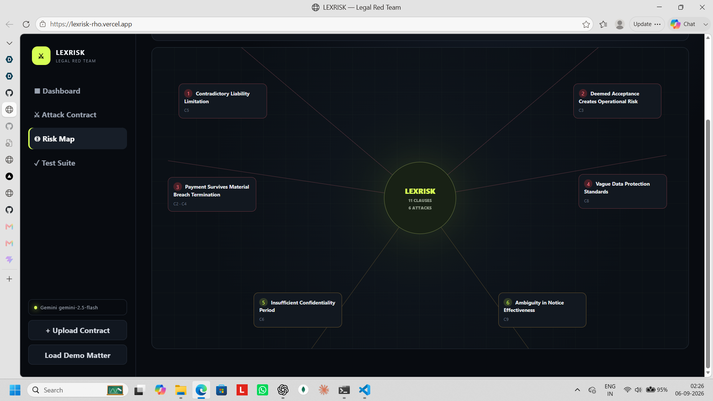
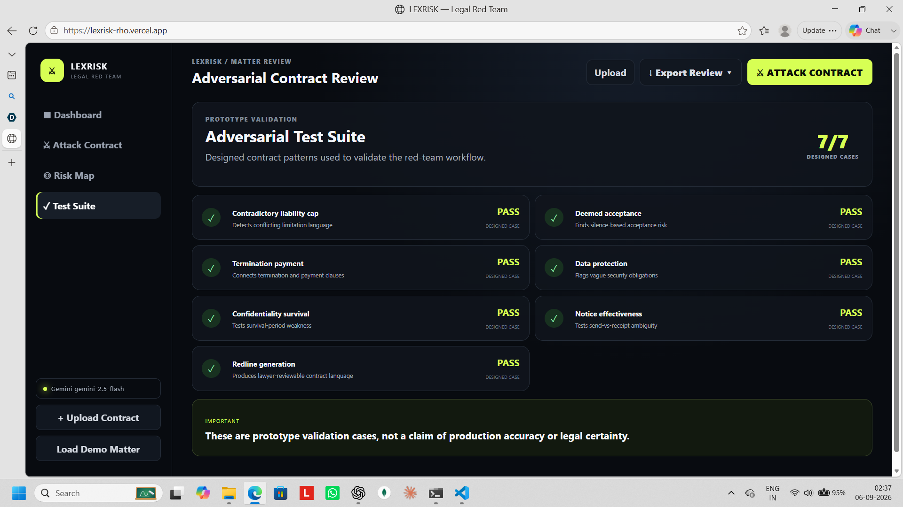

# LEXRISK

> **Attack the contract before they do.**

AI-powered adversarial contract review that finds loopholes, exposes risks, and generates safer redlines.

## 🚀 Live Demo

**Live App:** https://lexrisk-rho.vercel.app/

## 📸 Screenshots

### 1. Landing

The LEXRISK landing dashboard provides a clear starting point for adversarial contract review.



### 2. Contract Attack

Launch the **⚔️ Attack Contract** workflow to stress-test contract clauses from an opposing counsel perspective.



### 3. Risk Analysis & Legal Review

Review identified risks alongside **Opposing Counsel, Client Counsel, and Neutral Reviewer** perspectives.



### 4. Risk Map

Visualize the distribution and severity of risks across the contract.



### 5. Test Suite

Validate the prototype through the built-in test suite and review system performance.



## 💡 What is LEXRISK?

LEXRISK is an AI-powered contract review platform designed to **stress-test contracts before opposing counsel does**.

Instead of simply asking:

> "What does this contract say?"

LEXRISK asks:

> **"How could the other side use this contract against me?"**

It simulates three legal perspectives to uncover weaknesses, evaluate competing interpretations, and recommend fixes.

## ⚔️ How It Works

```text
Contract
   ↓
Clause Extraction
   ↓
⚔️ Opposing Counsel Attack
   ↓
🛡️ Client Counsel Defence
   ↓
⚖️ Neutral Review
   ↓
Risk Assessment
   ↓
Recommended Fix
   ↓
AI Redline
   ↓
Lawyer Accept / Reject
```

## ✨ Key Features

- ⚔️ **Adversarial Contract Review** — Simulates opposing counsel looking for exploitable weaknesses.
- 🛡️ **Client Counsel Defence** — Builds the strongest defence of the client's position.
- ⚖️ **Neutral Reviewer** — Evaluates competing interpretations using contract evidence.
- 🚨 **Risk Detection** — Identifies and prioritizes critical, high, medium, and low risks.
- 🔎 **Evidence Grounding** — Connects findings to specific contract clauses.
- 💥 **Worst-Case Scenarios** — Explains how identified weaknesses could affect the client.
- 🛠️ **Recommended Fixes** — Provides practical remediation suggestions.
- ✍️ **AI Redlines** — Generates proposed safer contract language.
- ✅ **Human-in-the-Loop** — Lawyers can accept or reject AI-generated changes.
- 📤 **Export** — Export analysis for further review and sharing.

## 🧠 The Adversarial Advantage

Traditional contract review is often defensive.

LEXRISK introduces an adversarial mindset:

```text
Read the clause
     ↓
Find the weakness
     ↓
Attack the wording
     ↓
Defend the position
     ↓
Determine the stronger interpretation
     ↓
Fix the weakness
```

## 👥 Three-Role Legal Review

### ⚔️ Opposing Counsel

Attempts to find the strongest interpretation that benefits the other party.

### 🛡️ Client Counsel

Develops the strongest defence of the client's position.

### ⚖️ Neutral Reviewer

Evaluates both arguments and determines which interpretation is better supported by the contract.

## 🔍 Evidence-Grounded Analysis

Each finding can follow:

```text
Risk → Severity → Clause → Evidence → Attack → Defence
→ Neutral Finding → Worst Case → Recommended Fix → AI Redline
```

When sufficient evidence is unavailable, the system can indicate that rather than presenting an unsupported conclusion as fact.

## 🚨 Risk Categories

LEXRISK can identify potential issues involving:

- Liability
- Indemnity
- Termination
- Payment
- Material breach
- Notice
- Definitions
- Cross-references
- Confidentiality
- Data protection
- Intellectual property
- Missing protections
- Dispute provisions

## 🛠️ Built With

- React
- TypeScript
- Vite
- Python
- FastAPI
- Pydantic
- Google Gemini AI
- PDF / DOCX / TXT extraction
- ReportLab
- python-docx
- Vercel
- Render

## 📁 Project Structure

```text
LEXRISK/
├── frontend/
│   ├── src/
│   ├── public/
│   ├── package.json
│   ├── package-lock.json
│   ├── index.html
│   └── vite.config.ts
│
├── backend/
│   ├── main.py
│   ├── requirements.txt
│   └── ...
│
├── sample_contract/
├── screenshots/
├── README.md
└── .gitignore
```

## 🚀 Run Locally

### Clone the repository

```bash
git clone https://github.com/Aurenox/LEXRISK.git
cd LEXRISK
```

### Start the backend

```bash
cd backend
python -m venv .venv
```

Windows:

```powershell
.venv\Scripts\activate
```

Install dependencies:

```bash
pip install -r requirements.txt
```

Create `backend/.env`:

```env
GEMINI_API_KEY=YOUR_GEMINI_API_KEY
GEMINI_MODEL=gemini-2.5-flash
```

Start FastAPI:

```bash
uvicorn main:app --reload
```

### Start the frontend

Open another terminal:

```bash
cd frontend
npm install
npm run dev
```

For the deployed frontend:

```env
VITE_API_URL=https://lexrisk-api.onrender.com
```

## 🎬 Demo Flow

```text
1. Open LEXRISK
2. Upload Contract
3. ⚔️ Attack Contract
4. Opposing Counsel
5. Evidence
6. Client Counsel Defence
7. Neutral Finding
8. Risk Assessment
9. Recommended Fix
10. AI Redline
11. Accept / Reject
```

## 🏆 Why LEXRISK?

LEXRISK is not another contract summarizer.

It changes the question from:

> **"What does the contract say?"**

to:

> **"How could the other side exploit it?"**

The goal is to help legal professionals identify weaknesses **before they become negotiation leverage or disputes**.

## 🔮 What's Next

- Contract-to-contract comparison
- Company-specific legal playbooks
- Negotiation intelligence
- Clause benchmarking
- Continuous contract monitoring
- Obligation and deadline tracking
- Collaborative legal review
- Expanded legal-source grounding

## ⚠️ Disclaimer

LEXRISK is an **AI-assisted legal review prototype**.

It is designed to support contract review and identify potential issues. It does not replace qualified legal advice, professional judgment, or independent legal review.

## 👨‍⚖️ Vision

> **Don't wait for opposing counsel to find the weakness. Find it first.**

**Attack the contract before they do.**
